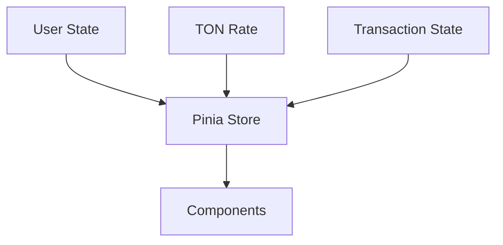
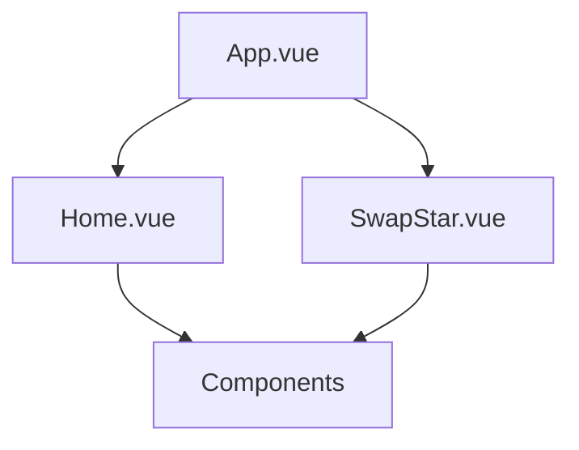

# System Patterns

## Architecture Overview
The application follows a Vue.js-based frontend architecture with the following key components:

1. **Core Components**
   - Vue 3 with Composition API
   - Pinia for state management
   - Vue Router for navigation
   - Telegram WebApp SDK integration

2. **State Management**
   - Centralized store for TON rates
   - User state management
   - Transaction state tracking

3. **API Integration**
   - RESTful API endpoints
   - Axios for HTTP requests
   - Error handling middleware

## Key Technical Decisions

### Frontend Framework
- **Vue 3**: Chosen for its reactivity system and composition API
- **TypeScript**: For type safety and better developer experience
- **Pinia**: Selected over Vuex for simpler state management

### UI/UX
- **Tailwind CSS**: For rapid UI development
- **Telegram Theme**: Following Telegram's design guidelines
- **Responsive Design**: Mobile-first approach

### State Management

### Component Structure

## Design Patterns

### 1. Composition API
- Used for better code organization
- Improved type inference
- Better code reuse

### 2. Store Pattern
- Centralized state management
- Type-safe state updates
- Reactive state changes

### 3. Component Communication
- Props for parent-child
- Events for child-parent
- Store for global state

### 4. Error Handling
- Global error boundary
- API error handling
- User feedback system

## Security Patterns

### 1. Data Validation
- Input sanitization
- Wallet address validation
- API request validation

### 2. Authentication
- Telegram WebApp authentication
- Session management
- Token handling

### 3. API Security
- Rate limiting
- Request validation
- Error handling

## Performance Patterns

### 1. Code Splitting
- Route-based splitting
- Component lazy loading
- Asset optimization

### 2. Caching
- Store caching
- API response caching
- Asset caching

### 3. Optimization
- Bundle size optimization
- Image optimization
- Code minification
